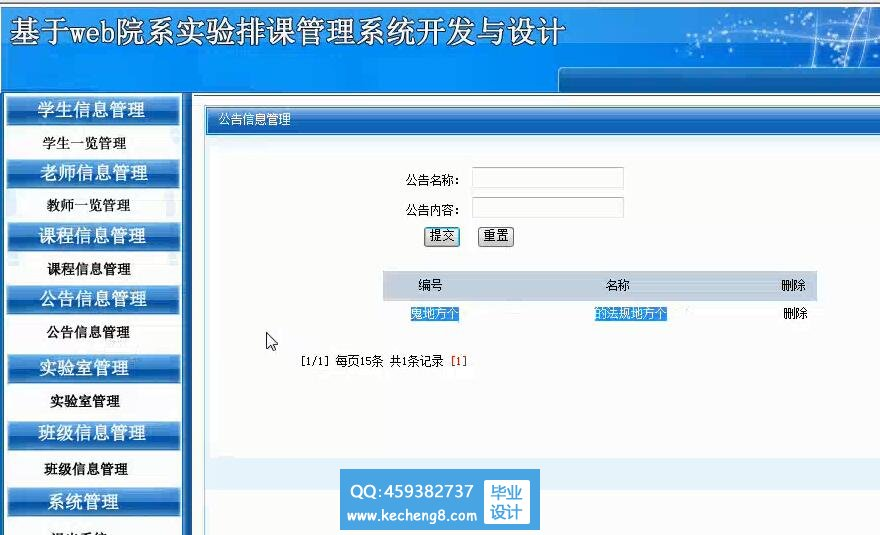
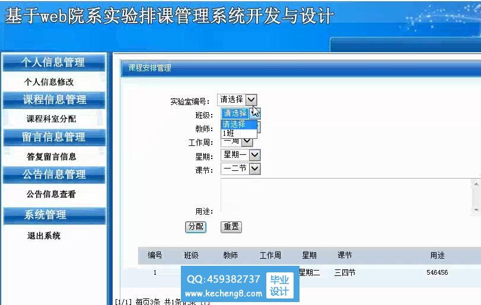

# 基于Java的高校实验室排课系统

（1）排课管理的相关人员包括管理员、教师，对不同的用户，系统如何提供有效服务，方便用户使用，加强管理监管力度。

（2）排课是指根据教学计划、自然班及教师的情况，为每门课程划分实验场地和时间，根据排课业务的特点，如何通过教学计划、实验室资源、时间等信息规定约束条件，获取排课需求要素。

（3）课程管理中所需数据来源多而复杂，且根据教学课程的变动，实验课程信息要求实时变动，如何保证数据的可维护性、可恢复性、安全性、可靠性的要求。

系统功能

系统的功能模块包括：基础数据管理、实验教学计划管理、实验课程申报、实验排课管理、查询统计。

1、基础数据管理

基础数据维护子系统是排课管理系统中比较重要的部分，它直接为排课过程提供数据依据，基础数据包括**实验室信息、实验负责教师、助教和学生信息**等。

实验教务人员对**该类信息进行添加、修改、删除**，对其他用户提供查询功能。

2、实验**教学计划**管理

实验课程教学计划是排课的重要依据，实验教务人员在每学期处获取实验课程计划表后通过系统系统初始化导入数据库，并设定实验课程排课优先级等参数，实验教师可以通过系统来查询该学期所开设的实验课程信息。

3、实验课程安排管理 

实验课程安排是系统最核心的功能，在排课时应当充分考虑到合理利用实验室资源，以及实验负责教师的辅导实验时间，按学生上机人数和课程性质选用实验室。在实验课程数据生成之后对排课条件进行高级设置满足人性化要求，尤其是对某些实验教师和实验室的特殊要求。根据**教学进程系统自动排课**，对开设课程的各班级自动分配实验室，安排课程时间，按课程优先顺序将所有课程进行编排，生成实验课表。**对系统排课产生的不合理情况，通过人工干预的方式调整**。

实验开课过程中出现课程临时调整时，要及时更新实验课表，并写入课程调整记录表。 

4、数据统计查询 

数据的查询和统计是信息管理系统中必备的基本功能，对生成的课表可**按班级、实验负责教师、实验室进行查询打印**，**实验室、实验课程教学计划等信息也需要具备查询功能**。实验管理员对各实验室的开课率进行统计。 s

